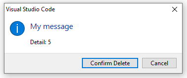
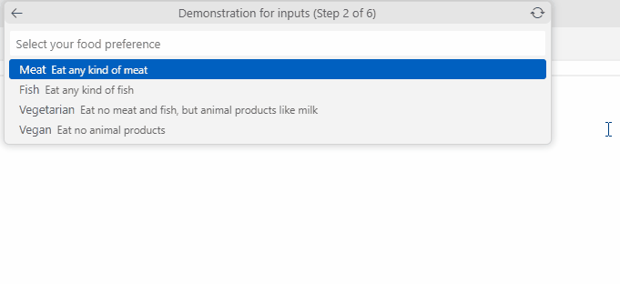
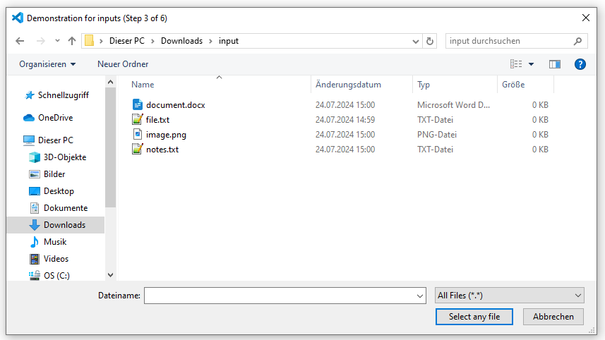
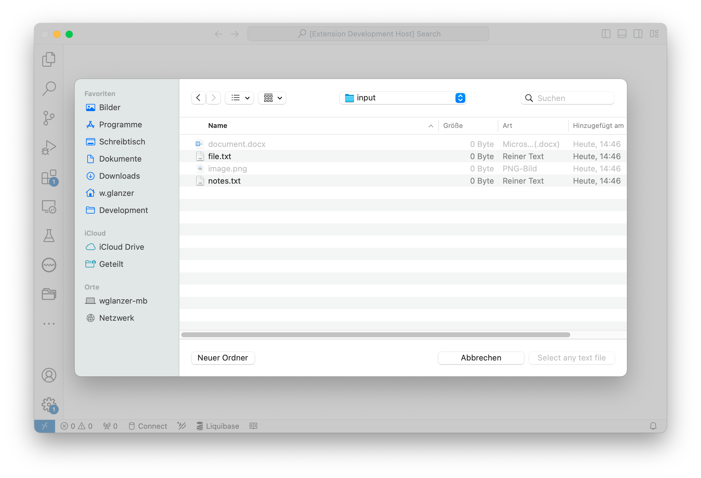
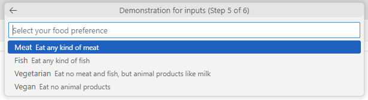

# vscode-input

This is used to add a simple and easy to use input elements to any VS Code extension.

These input elements should be used for any multi step inputs.

## Installation

This module is published at [GitLab](https://gitlab.adito.de/plattform/designer/vscode-input/-/packages) and [Nexus](https://nexus.adito.cloud/#browse/browse:xrm). Please check the corresponding sites on how to add the npm repository to your project.

After you have added the repository to your project, you can install it normally.

```shell
npm i @aditosoftware/vscode-input
```

## Usage

### Basic Usage

Your project is expected to have any dependency to [@aditosoftware/vscode-logging](https://gitlab.adito.de/plattform/designer/vscode-logging) and configure it accordingly.

Before you can start using any multi step inputs, you need to initialize the logging via `initializeLogger`. This can be done in your `activate` function of the extension.

```typescript
import * as vscode from "vscode";
import { Logger } from "@aditosoftware/vscode-logging";
import { initializeLogger } from "@aditosoftware/vscode-input";

export async function activate(context: vscode.ExtensionContext) {
  // initialize the logger
  Logger.initializeLogger(context, "NameOfYourExtension");
  // and pass the logger to the input
  initializeLogger(Logger.getLogger());
}
```

The basic usage is to define the [components](#components) that should be used for the multi step input, then call the `handleMultiStepInput`, which goes through the array of components and show them step by step and then [handle the result](#handle-the-result) given by the dialog.

This can be an example call order of the multi step input.
You can use this example. The only things you need to do is to fill the [components](#components), set the `title` and [handle the result](#handle-the-result).

```typescript
async function callMyDialog() {
  // The components that should be shown
  const components = [];

  // The title that should be shown above every input. It will automatically include any step counter
  const title = "Demonstration for inputs";

  // call the multi step input
  const result = await handleMultiStepInput(title, components);

  if (result) {
    // handle the result
  }
}
```

### Handle the result

The result can be either `undefined` (when any input was cancelled or a confirmation dialog was not confirmed) or an object of the class `DialogValues` (when every input has an value).

The attribute `uri` of the `DialogValues` will be never filled from this dependency. Instead, you can fill it before calling the dialog as an additional information, if the dialog was called on a file / folder.

The attribute `confirmation` of the `DialogValues` will be only filled, when the input type `ConfirmationDialog` was there. You do not need to read this value, because no confirmation will result in a `undefined` result.

The attribute `inputValues` holds all inputs that were made during the dialog. For reading the `inputValues`, you need the `name` of any [component](#components). All the values will be given as `string[]`, even if the input was just a string.

### Custom actions before and after a component

You can make custom action before and after every input.

If you want your step only be shown at specific circumstances, e.g. when a specific previous dialog value was selected, then you can use `onBeforeInput` in your options. If the function returns `false`, then this component will be skipped.
The step count will be adjusted accordingly. If you have a multi step input with 3 steps, and the second step will be skipped, then the count will be `Step 1 of 3` (for the first element) and `Step 2 of 2` (for the third element).

If you want to manipulate your input data after an input was made, you can use `onAfterInput`. This can be for example used, if you get a value from any dialog values normal input that should be used as an uri instead.

## Components

All components have one constructor, which takes `<ComponentName>Options`. These options are explained in the documentation of the corresponding component.

**Note:** The `name` attribute needs to be always there. This is used to assign the inputted values in the `DialogValues`. Therefore, the name need to be unique for every component in a multi step input. However, you can reuse the name among different multi step inputs.

A complete example can be seen in [sample.ts](/test/sample/sample.ts).

### Confirmation Dialog

Show a confirm dialog. This should be used as a last step of the multi-step-input to confirm any destructive options (e.g. deletion).

The dialog itself will be shown in the foreground and looks OS specific.

```typescript
new ConfirmationDialog({
    name: "Confirmation",
    message: "My message",
    detail: (dialogValues: DialogValues) => `Detail: ${dialogValues.inputValues.size}`,
    confirmButtonName: "Confirm Delete",
  }),
```

This code will lead the following input:

| Windows                                                   | macOs                                               |
| --------------------------------------------------------- | --------------------------------------------------- |
|  |  |

You can see that in both cases, it is an os specific dialog. The position of the buttons can not be changed and may be different depending on the OS.

### Input Box

Let the user enter a text value. The result will be always a `string`. In the example below you can see how to extract the value from the result.

This input box is highly customable. That means, you have every option from `vscode.InputBoxOptions` available in the attribute `inputBoxOptions`, except `title`.

Example for a multi step input with one input boxes:

```typescript
const components = [
  // This box has only the placeholder given. This is a required element for any inputs.
  new InputBox({
    name: "userName",
    inputBoxOptions: {
      placeHolder: "Give any user name",
    },
  }),

  // place any other inputs here
];

const result = await handleMultiStepInput("Demonstration for inputs", components);

if (result) {
  // getting the results of the input values
  const userName = result.inputValues.get("userName")?.[0];

  // handle result
}
```

This code will lead the following input:


Here you can see, that a given title was used.

### Loading Quick Pick

This component is similar to [Quick Pick](#quick-pick), but adds a better loading handling. You should use this component, if you want a quick pick with loading and reloading abilities. This should be also used, if your load method takes a while.

Since `LoadingQuickPick` extends [Quick Pick](#quick-pick), some options are the same and not described here.

Additionally, you can give an additional `reloadItems` function to reload your items. If you do not give a separate function, then `generateItems` will be used to reload the items.

During the loading, a placeholder for the loading will be visible. For your reload button, you can customize the tooltip with the `reloadTooltip`.

```typescript
new LoadingQuickPick({
  name: "foodPreferenceLoading",
  placeHolder: "Select your food preference",

  generateItems: () => [
    { label: "Meat", description: "Eat any kind of meat" },
    { label: "Fish", description: "Eat any kind of fish" },
    { label: "Vegetarian", description: "Eat no meat and fish, but animal products like milk" },
    { label: "Vegan", description: "Eat no animal products" },
  ],
  // long running function to reload the items
  reloadItems: async () => {
    const foodPreferences: string[] = await queryWebsiteForFoodPreferences();

    return foodPreferences.map((pPreference) => {
      const item: vscode.QuickPickItem = {
        label: pPreference,
      };
      return item;
    });
  },
  reloadTooltip: "Reload food preferences",
});
```

This will produce the following input:



You can see here the custom reload tooltip. During the loading, you can see the loading spinner (above the first option and below the input) as well as the loading placeholder. After the loading, it will change back to your given placeholder.

### Open Dialog

Shows an OS specific file chooser to select any number of files and folders.

You can give any options to the open dialog of vscode by using the `openDialogOptions` except `title`. The title that will be shown is the title given in `handleMultiStepInputs`.

**NOTE**: The `title` will not be visible on macOS. Therefore, `openLabel` should contain information what the user should input in this dialog.

```typescript
const inputs = [
  new OpenDialog({
    name: "chooseAnyFile",
    openDialogOptions: { openLabel: "Select any file" },
  }),

  new OpenDialog({
    name: "chooseTextFile",
    openDialogOptions: {
      openLabel: "Select any text file",
      filters: {
        Text: ["txt"],
      },
    },
  }),
];
```

#### Open dialog for `chooseAnyFile`

You can see here that you can choose any file you want. On Windows, you can see the title `Demonstration for inputs (Step 3 of 6)` which can not be seen on macOs.

##### Windows



##### macOS


#### Open dialog for `chooseTextFile`

You can see here that the dialog is restricted to `txt` files. On Windows, you can see the title `Demonstration for inputs (Step 4 of 6)` which can not be seen on macOs.

##### Windows


##### macOS



### Quick Pick

Any drop down for selecting one or multiple values.

To set the items, you need to use the `generateItems` attribute. Here you can give either a sync or async function to load any data. These function can either return `<vscode.QuickPickItem[]` or `QuickPickItems`, which can be used to set a custom additional placeholder after the loading.

If you want a quick pick with loading, you should use [Loading Quick Pick](#loading-quick-pick).

A basic quick pick can look as following:

```typescript
new QuickPick({
  name: "foodPreference",
  placeHolder: "Select your food preference",
  generateItems: () => [
    { label: "Meat", description: "Eat any kind of meat" },
    { label: "Fish", description: "Eat any kind of fish" },
    { label: "Vegetarian", description: "Eat no meat and fish, but animal products like milk" },
    { label: "Vegan", description: "Eat no animal products" },
  ],
});
```

This code will lead the following input:



### Own Components

You can write your own components by either extending `InputBase` or any of the existing classes.

Here is a checklist of what needs to be considered when making a new input:

- Extend the corresponding options in order to pass only one argument in the constructor.
- Make your overwritten `showDialog` function `async`
- Reduce the return arguments from `showDialog` from the given `Promise<string | boolean | string[] | undefined>` to a smaller range, e.g. `Promise<string | undefined>`
- Do not set any custom title. Instead, use the passed title in `showDialog`. This already contains a step counter.
- If your component supports a back button (when depending on `vscode.InputBox` or `vscode.QuickPick`), show it when the flag `showBackButton` is set:
  ```typescript
  if (showBackButton) {
    quickPick.buttons = [vscode.QuickInputButtons.Back];
  }
  ```
  Don't forget to handle the back button by resolving `InputAction.BACK`:
  ```typescript
  quickPick.onDidTriggerButton((button) => {
    if (button === vscode.QuickInputButtons.Back) {
      resolve(InputAction.BACK);
    }
  });
  ```

## Contribution Notes

- Never use `Logger.getLogger()`. Use `logger` from the file `handleMultiStepInput.ts` instead. Otherwise the logging will not work.
